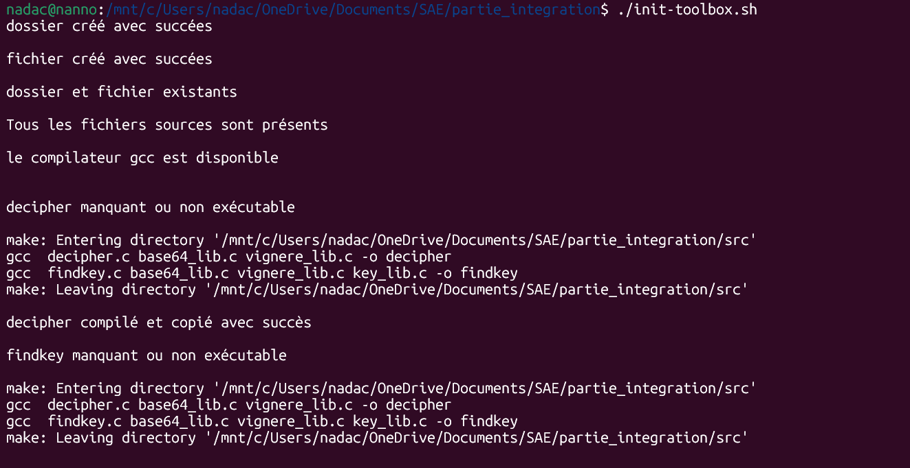
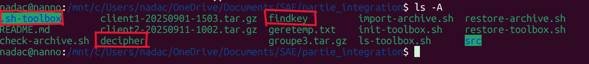
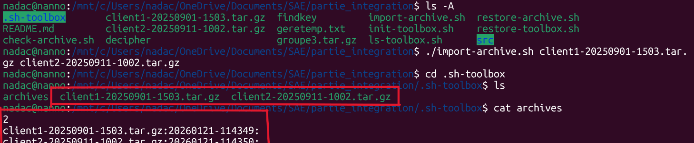
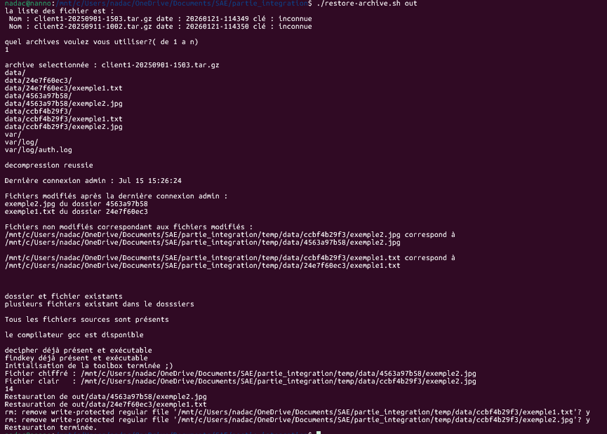
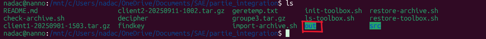
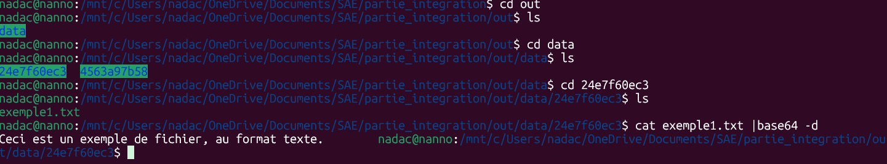

# ransomware-recovery-toolbox
Ce projet est une boîte à outils de cybersécurité en C qui simule le comportement d’un ransomware pour analyser le chiffrement de fichiers et proposer des fonctionnalités de déchiffrement et de récupération des données. Il se concentre sur les mécanismes de protection et de restauration des fichiers.

### ⚙️ Initialisation de la toolbox

Le script met en place l’environnement de travail et génère les exécutables nécessaires s’ils sont absents.

### 📂 Importation de l’archive

Les archives sont ajoutées à la toolbox afin de pouvoir être analysées et traitées.

### 🔓 Restauration de l’archive

Le système parcourt l’archive, identifie les fichiers chiffrés et lance le processus de restauration.

### 🔑 Récupération de la clé

La clé est déduite automatiquement à partir des fichiers chiffrés et stockée par le système.

### 📄 Fichier déchiffré

Le contenu du fichier est correctement récupéré et peut être relu normalement.
